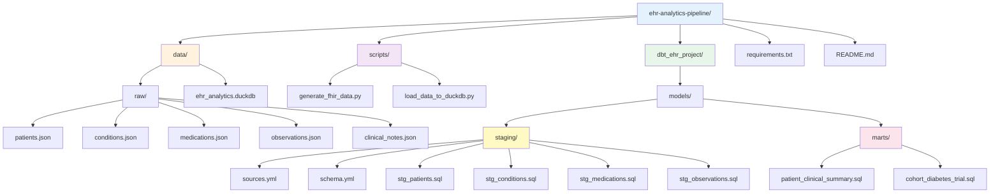

# ehr-analytics-pipeline
end to end clinical data transformation pipeline using dbt, dagster, and DuckDB with LLM-powered entity extraction
# EHR Analytics Pipeline for Clinical Trial Optimization

End-to-end data pipeline transforming raw FHIR healthcare data into analytics-ready patient cohorts for clinical trial recruitment and real-world evidence generation.

## Problem Statement

**Business Context:** Pharmaceutical companies developing new therapies need to efficiently identify eligible patients for clinical trials from massive Electronic Health Record (EHR) datasets.

**Current Challenges:**
- Data scientists spend 70% of time cleaning disparate EHR data sources
- FHIR data arrives in deeply nested JSON structures unsuitable for analysis
- Manual patient cohort identification is slow and error-prone
- Clinical notes contain rich information locked in unstructured text

**Solution:** Automated pipeline that transforms raw FHIR data → structured analytics tables → trial-ready patient cohorts.


## Architecture


*End-to-end data transformation from synthetic FHIR generation through dbt staging and marts to analytics-ready clinical trial cohorts.*

## Quick Start

### Prerequisites
- Python 3.12+
- Git

### Installation
# Clone repository
git clone https://github.com/minnie-cheeti/ehr-analytics-pipeline.git
cd ehr-analytics-pipeline

# Set up virtual environment
python -m venv venv
venv\Scripts\activate  # Windows
# source venv/bin/activate  # Mac/Linux

# Install dependencies
pip install -r requirements.txt
```

### Generate Data & Run Pipeline
```bash
# Generate synthetic FHIR data
python scripts/generate_fhir_data.py

# Load into DuckDB
python scripts/load_data_to_duckdb.py

# Run dbt transformations
cd dbt_ehr_project
dbt run

# Run data quality tests
dbt test
```


## Sample Output: Trial Cohort

**Type 2 Diabetes Drug Trial - Eligible Patients**

| Patient ID | Age | Latest HbA1c | Priority |
|------------|-----|--------------|----------|
| patient-21 | 21  | 9.4%         | High     |
| patient-25 | 29  | 9.2%         | High     |
| patient-10 | 21  | 9.2%         | High     |
| patient-37 | 29  | 9.1%         | High     |
| patient-24 | 27  | 8.5%         | Medium   |

**Inclusion Criteria:**
- Age 18-65
- Type 2 Diabetes diagnosis (ICD-10: E11.*)
- HbA1c > 7.5%
- Currently on Metformin
- No heart failure history


## Tech Stack

| Component | Technology | Purpose |
|-----------|-----------|---------|
| **Data Generation** | Python, fhir.resources | Create realistic synthetic patient data |
| **Database** | DuckDB | Fast analytical database for healthcare data |
| **Transformation** | dbt | SQL-based data modeling and testing |
| **Standards** | FHIR, ICD-10, RxNorm, LOINC | Healthcare data interoperability |
| **Version Control** | Git, GitHub | Code management and portfolio |

## Project Structure

## Data Quality

**11 Automated Tests:**
- Unique constraints on all primary keys
- Not-null validation on critical fields
- Referential integrity (all conditions link to valid patients)
- All tests passing 


## Use Cases

1. **Clinical Trial Recruitment:** Identify eligible patients based on complex inclusion/exclusion criteria
2. **Real-World Evidence:** Analyze medication effectiveness and patient outcomes
3. **Population Health:** Track disease prevalence and comorbidities
4. **Medication Adherence:** Monitor prescription fills and identify gaps


## Future Enhancements

LLM-powered entity extraction from clinical notes
Dagster orchestration for scheduled pipeline runs

